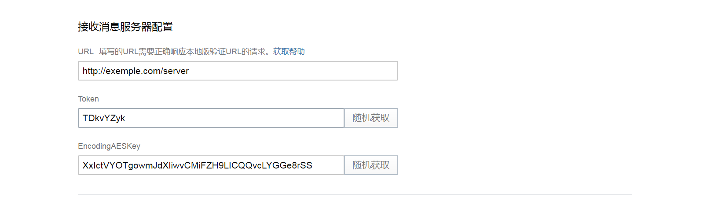

## 入门 {docsify-ignore}

接下来的讲解将通过一个eggjs应用来对应文档中的内容讲解

## 初始化一个示例项目

详细的可参考eggjs官方文档：

```bash
$ mkdir egg-example && cd egg-example
$ npm init egg --type=simple
$ npm i
```
## 引入egg-echat插件

```bash
$ npm i egg-echat --save
```

## 配置


### 在框架中启用配置
`{app_root}/config/plugin.js`
```js
exports.echat = {
  enable: true,
  package: 'egg-echat',
};
```

### 在框架中配置
`{app_root}/config/config.default.js`
```js
exports.echat = {
    cache: {
        flag: 'echat', //此处可自行更改，主要在采用文件存储accessToken时，为了区别不同的企业，如果只有一个企业则可忽略
        // driver: 'redis' //此处可配置缓存accessToken的驱动，目前支持文件【默认】和redis，采用redis时，需要安装egg-redis插件
    },
    CorpInfo: {
        ApiUrl: 'http://1.2.3.4:8082', //请勿带 " / ,此处请填写私有化部署的入口ip"
        CorpID: 'wl47sadasw3w', //找到对应的企业ID
        OauthUrl: 'https://open.weixin.qq.com/connect/oauth2/authorize', //网页授权链接，一般不需要改变
    },
    AgentInfo: {
        AgentId: 1000177,
        AgentSecret: 'yIgAOVx0XDla6Qka_81pbHZ6BPoLPXyZFSKUTCBqeN4',
        token: 'TDkvYZyk',
        EncodingAESKey: 'XxIctVYOTgowmJdXliwvCMiFZH9LICQQvcLYGGe8rSS',
        oauth: {
            // scopes: 'snsapi_userinfo',  //  snsapi_base | snsapi_userinfo | snsapi_privateinfo , 
            // redirect_uri: '' //框架内一般不用填写，中间件可自动获取当前的页面，也可自定义
        }
    },
};
```

### 服务器验证

我们在企业微信应用开启接收消息的功能，将设置页面的 token 与 aes key 配置到 agents 下对应的应用内：
对应上边配置的： token 和 EncodingAESKey 参数；

参考截图：




### 以下是在egg框架内的代码演示

#### 在控制器中，添加对应的server方法
`{app_root}/app/controller/home.js`
```js
//服务端验证
  async server() {
      const echat = await this.ctx.echat();
        const server = echat.server();

        //如果只是验证url
        //let result =  await server.server().send();


        //验证url并且返回一些内容
        let result = await server.server().push(async($message) => { //回调中使用
            switch ($message['MsgType']) {
                default: 
                    return '您好，感谢您的参与，请关注活动规则！';
                break;
            }
        });
        //返回企业微信的消息，包括加密的字符串和验证URL的明文字符串，这块不明白也没有关系
        this.ctx.body = result; 
  }

```

#### 添加路由
`{app_root}/app/router.js`
```js
···
  router.get('/server', controller.home.server); //这一条是用来，接收企业微信用来验证url的； GET
  router.post('/server', controller.home.server); //这一条是用来验证url成功后，接收来自客户端消息的路由，POST
···
//一般只用一条即可，上述只是为了说明原理
  router.all('/server', controller.home.server);
```
此时我们发现,虽然验证URL验证成功了，但是在客户端给服务段发送消息时， 还会报错，是因为：   
-  `eggjs` 框架本身不接收 `XML`；   
-  需要给 `/server` 添加 `CSRF` 白名单,添加设置如下：   

`{app_root}/config/config.default.js`
```js
  // 覆盖egg自带的配置 使支持接收xml参数
  config.bodyParser = {
    enable: true,
    encoding: 'utf8',
    formLimit: '100kb',
    jsonLimit: '100kb',
    strict: true,
    // @see https://github.com/hapijs/qs/blob/master/lib/parse.js#L8 for more options
    queryString: {
      arrayLimit: 100,
      depth: 5,
      parameterLimit: 1000,
    },
    enableTypes: ['json', 'form', 'text'],
    extendTypes: {
      text: ['text/xml', 'application/xml'],
    },
  };
  //在微信网页授权的时候，省去csrf验证
  config.security = {
    csrf: {
      // 判断是否需要 ignore 的方法，请求上下文 context 作为第一个参数
      ignore: ctx => {    
        if((ctx.request.url).indexOf("/server") != -1){ //此处的server需要根据实际需要来设置，也可用正则表达式
          return true;
        }
        return false; 
      },
    }

  };
```
此时，重启应用一切正常。

good luck！

#### 总结

使用步骤：

- 安装
```js
$ npm i egg-echat --save
```
- 添加控制器方法
- 实例化echat实例
```js
const echat = await this.ctx.echat(); //文档其他地方，echat实例不单做说明
```
- 添加路由

- 更多详细使用方式，请查看文档；


