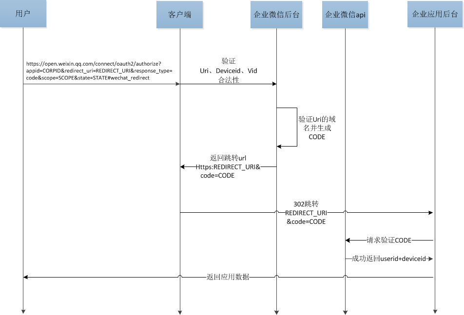

开发网页授权的时候，最好先了解 `oAuth2` 的相关理论， 关于企业微信详细的授权过程如下图（来自官方文档）：

   

时间紧急来不及研究，也没有问题，插件内部已经实现好了，只需要配置一下就可以啦，so easy！！！

原理：eggjs中间件实现，中间的用法可参考 `eggjs` 文档 [中间件](eggjs.org/zh-cn/basics/middleware.html#使用中间件) 部分。

## 一般使用
在配置中需要配置相关的 `scope`,默认为：`snsapi_base`,此配置只能拿到基本信息，详见企业微信文档。在控制器中拿到授权信息：

### 主要方法

- redirectUrl(url, scope, state)

> - url 重定向的地址(eg: http://x.x.x.x:port)，code会以查询参数的形式返回给应用(eg:http://x.x.x.x:port?code=asdfghjkl565ashhdgas )
> - scope  共有三种可选 snsapi_base(默认) | snsapi_userinfo | snsapi_privateinfo 
> - state 携带一些加密 回调回来可以以查询参数的形式(http://x.x.x.x:port?code=asdfghjkl565ashhdgas&code=test)完整携带回来

`{app_root}/app/controller.home.js`
```js

async oauth2() {

  const { ctx } = this;

  // 拿到 echat 实例
  const echat = await this.ctx.echat();
  // 先判断 用户是否登录，一下代码需要根据实际情况而定
  const isEchatAuth = await ctx.service.echatAuth.check();
  if(!isEchatAuth) {
     // 创建 oAuth2 实例
    const oAuth2 = echat.oauth2();
    // 获取到 code ,这个需要分情况看 如果前后端分离的话，可以前端传过来。单体应用的话，直接用下面的代码拿到code
    const code = ctx.query.code;
    // 此处判断一下，是否拿到了code，如果没有则需要重定向到企业微信的授权地址
    if (!code) {
      // redirectUrl()方法中的参数详解
      ctx.unsafeRedirect(await oauth2.redirectUrl()); // 此处需要在系统配置里重定向白名单，并不是在此插件配置项
        return;
    }


    
    // 判断用户是否需要详细信息
    function isDetail() {
                let scope = (ctx.app.config.echat.Agent.oauth.hasOwnProperty('scopes') ? ctx.app.config.echat.Agent.oauth.scopes : null) ;
                return scope === 'snsapi_base' ? false : true;
    }

    // 拿到授权回来的 用户信息
    let userInfo = await oauth2.getUserInfo(code, isDetail());
    // 后续做登录相关业务逻辑
    //···
    // 此部分相关业务逻辑，最好写在中间中，最后将用户信息挂在 ctx 全局中 

  }
  
}


```

## 利用 eggjs 中间件 使用

如果是单体应用（前端代码和后端部署在一起），就可以简单的用插件内部的中间件机制，很轻松的拿到用户信息。

示例讲解：

如果全局需要网页授权，则需要在配置文件中配置，如果仅仅是在某几个请求路径需要授权，则只需要在路由配置中应用即可：

`{app_root}/app/router.js`

```js
module.exports = app => {
  const echatOauth2 = app.middleware.echatOauth2(); //此处配置中间件
  const { router, controller } = app;
  ...
  router.get('/oauth2', echatOauth2, controller.home.oauth2); //在oauth2中应用
  ...
};

```


`{app_root}/app/controller.home.js`

```js
const echat = await this.ctx.echat();
//请注意，不要将项目中的session都设置ctx.session 中，否则会覆盖，在平时开发中，也应该在session中对应自己的项目名称。如：存session时应为 ctx.session.projectName = {a: 1; b: 2}
let userInfo = await this.ctx.session.echat;

console.log(userInfo); 

//"userid":"USERID",
//"deviceid":"DEVICEID",
//"user_ticket": "USER_TICKET"，
//"expires_in":7200,
//"usertype":2,
```

可通过:   
`userInfo.userid` 获取用户id      
`userInfo.deviceid` 获取用户设备id   
`userInfo.usertype` 获取用户类型  -->【成员身份信息，2：超级管理员, 4:分级管理员，5：普通成员】   

下列的信息，需要将 `scope` 为 `snsapi_userinfo`，此设置，不包括手机和信箱，如果设置为 `snsapi_privateinfo`,则无限制获取   

`userInfo.name` 获取用户姓名      
`userInfo.mobile` 获取用户手机号   
`userInfo.avatar` 获取用户头像   
`userInfo.email` 获取用户头像   
`userInfo.gender` 获取用户性别  -->【0表示未定义，1表示男性，2表示女性】   

`userInfo.original` 获取企业微信原始的返回数据


- 注意，如果使用了nginx等反向代理，则需要在插件配置文件中将 redirectUrl 改为 互联网入口地址。

```js
//··· 省略部分代码
AgentInfo: {
        //···（修改以下部分）
        // redirect_domain: '', //可信域名、不写http(https)协议
        // home_url: '', //主页链接，若没有则不写 写http(https)协议
},
```


